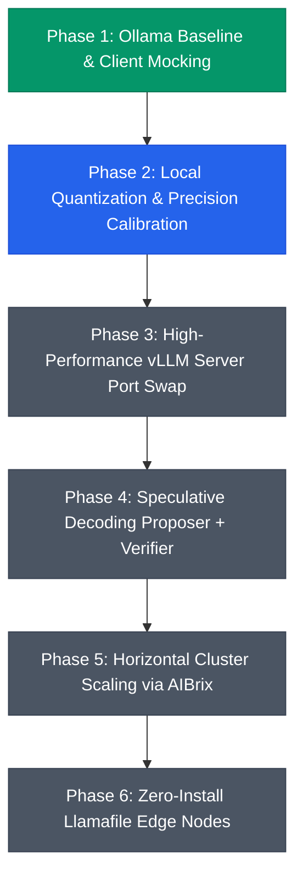

# CHERENKOV · Sovereign Security Platform Roadmap

This document outlines the high-level system architecture, development roadmap, and feature release schedule for the **Cherenkov Sovereign Security Platform**. It establishes a clear technical vision for scaling Cherenkov from a single-machine local auditor to a horizontally-scaled, high-throughput enterprise security scanner.

---

## 1. Vision & Architecture Philosophy

Cherenkov is engineered to solve a single, critical challenge in enterprise threat intelligence: **enabling high-capacity, multi-agent AI security audits under strict zero-egress, sovereign, and air-gapped constraints.**

### The Core Architectural Pillars:
1. **Sovereignty First:** Zero external dependencies, no cloud endpoints, no third-party telemetry.
2. **Computational Efficiency:** Maximal VRAM optimization using modern quantization and speculative decoding to run heavy security-reasoning agents on commodity or regulated enterprise hardware.
3. **High Throughput Swarms:** Asynchronous multi-agent execution scheduled dynamically using intent-aware local routing.

---

## 2. Multi-Phase Development Roadmap

### Phase 1: Ollama Baseline & Unified Client Mocking (Complete)
* **Goal:** Establish a performance control group and draft a highly stable, pluggable client layer to isolate LLM client calls from core agent loops.
* **Deliverables:**
  * 📜 **`scripts/benchmark_ollama.sh`**: Multi-agent emulator using `guidellm` to load-test local Ollama servers.
  * 📜 **`src/vllm_client.py`**: Unified OpenAI-compatible wrapper with statistics tracking, logs auditing, and exponential backoff retry policies.
  * 📜 **`src/agent_runner.py`**: Runnable end-to-end sandbox representing a Cherenkov scan session with Static Analysis (TENSOR) and Compliance Triaging (KINETIC) agents.
  * 📜 **`tests/test_integration.py`**: Connection, latency, and capability assertion suite.

---

### Phase 2: Local Quantization & Precision Calibration (Active)
* **Goal:** Shrink the primary security-reasoning model (**TENSOR** — Qwen2.5-Coder 7B) VRAM footprint from **14 GB to ~4.5 GB** using INT4 (W4A16) quantization without losing vulnerability-detection capabilities.
* **Key Innovations:**
  * **GPTQ class-based modifiers** to prevent serialization drift.
  * **Code-domain calibration pruning** using the `codeparrot/github-code` dataset to protect analytical precision over general-purpose chat formatting.
* **Status:** Quantization script `scripts/quantize_tensor.py` is fully codified and approved for local execution.

---

### Phase 3: High-Performance vLLM Server Port Swap (Planned - Q2 2026)
* **Goal:** Replace the legacy Ollama execution runtime with a dedicated, high-concurrency **vLLM** server to take advantage of PagedAttention.
* **Metrics Targets:**
  * **10× to 30×** increase in total scanner throughput.
  * **50% reduction** in Time to First Token (TTFT) latency for triage agents.
* **Integration Strategy:** Swap `UnifiedLLMClient` configuration backends and verify complete API parity using `test_integration.py`.

---

### Phase 4: Speculative Decoding (Planned - Q3 2026)
* **Goal:** Drastically reduce token-generation latency by using the lightweight **KINETIC** (1.5B) model as a draft proposer and the quantized **TENSOR** (7B) model as a verifier.
* **System Design:** vLLM native speculative execution utilizing standard token matching loops. Under this setup, KINETIC drafts speculative vulnerability reports, and TENSOR verifies them in a single forward pass, providing high-quality 7B reasoning at near-1.5B token generation speeds.

---

### Phase 5: Horizontal Cluster Scaling via AIBrix (Planned - Q4 2026)
* **Goal:** Horizontally scale Cherenkov's multi-agent swarm across distributed Kubernetes clusters for enterprise security scans.
* **Primitive Features:**
  * **KV Cache Sharing** across nodes to eliminate duplicate prompt computations.
  * **Prefix Caching** to share system security prompts between scanning nodes.
  * **Dynamic Autoscaling** to spin up vLLM replicas based on active scan queues.

---

### Phase 6: Zero-Install Llamafile Edge Nodes (Planned - 2027)
* **Goal:** Deliver single-file, self-executing Cherenkov binaries for audits on non-Dockerized, offline, or low-spec customer hardware.
* **System Design:** Bundle model weights and llama.cpp runtimes into standalone executables that require zero setup or configuration on edge auditor laptops.

---

## 3. Version History & Release Metrics

| Version | Status | Primary Backend | Target VRAM | Scan Concurrency | Target Throughput |
|---|---|---|---|---|---|
| **v0.1.0-alpha** | Retired | Ollama (Qwen-7B) | 16 GB | 1 (Single-Agent) | ~8 tokens/sec |
| **v0.2.0-beta** | **Active** | Ollama (Unified Client) | 16 GB | 5 (Swarm Emulator) | ~14 tokens/sec |
| **v0.3.0-rc** | Planned | vLLM (Quantized INT4) | 6 GB | 10 (Swarm) | ~120 tokens/sec |
| **v1.0.0-prod** | Planned | vLLM (Speculative) | 8 GB | 20+ (Enterprise Swarm) | ~250+ tokens/sec |
