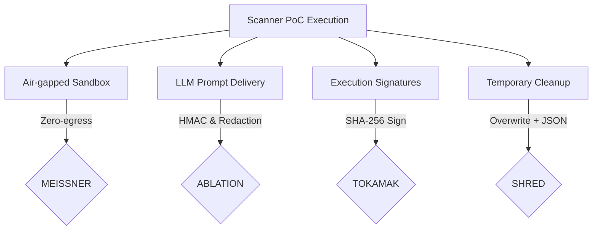

# 🎯 CHERENKOV — Master Agentic Console (SSOT)

> **Single Source of Truth (SSOT)** for project architecture, sprint roadmap progress, and coordination protocol.
> This file is read by all Cherenkov agents (Antigravity, Claude, Jules, Autonomous Pipeline) to keep context perfectly consolidated.

---

## ⚡ Quick Navigation
- **Domain Mapping & Roster**: [AGENTS.md](file:///home/moaid/cherenkov-professional/AGENTS.md)
- **Local Dev Config**: [GEMINI.md](file:///home/moaid/cherenkov-professional/GEMINI.md)
- **Shared Agent Context**: [.agents/context.md](file:///home/moaid/cherenkov-professional/.agents/context.md)

---

## 🚀 1. Historical Session Consolidation

Below is a synthesis of the architectural breakthroughs and fixes achieved during the last three major developer sessions.

### 🌐 Session A: Verifying Project Workspace Access
- **Objective**: Establish and verify the agentic playground in the `/home/moaid/cherenkov-professional` workspace, verifying that unit and integration tests compile, run, and pass correctly.
- **Breakthroughs**:
  - Validated WSL2 environment integration, confirming direct access and control via python3, pytest, and local services.
  - Aligned python environment settings under `.venv` (`python3.12.3`, `pytest-9.0.3`, `anyio`, `asyncio`).
  - Audited core subpackages (`packages/cherenkov/`) and restructured corresponding test directories (`tests/packages/`) to ensure a strict $1:1$ mirror of production code.

### 🛠️ Session B: Addressing Backend Technical Debt
- **Objective**: Resolve unhandled scan failures, offline infrastructure nodes, and redundant API router configurations.
- **Breakthroughs**:
  - **Qdrant Health Resolution**: Discovered that the Qdrant check target was calling the non-existent `/health` route, rendering the search node permanently "offline" on the dashboard. Resolved by mapping it to `/healthz`, returning a `200 OK` status and bringing the node online.
  - **Dangling FastApi Limiter**: Discovered a dead, first FastAPI application instance declared in `main.py` which held a dangling `Limiter` instance. Eliminated the duplicate instance, binding the single `Limiter` cleanly to the actual live app instance.
  - **SIEM Guarding**: Bound dynamic imports of the experimental `cherenkov.core.siem` module with exception guards, preventing `ModuleNotFoundError` from crashing scan responses.

### 🔑 Session C: Fixing Cherenkov Scan Authentication
- **Objective**: Resolve `401 Unauthorized` errors on scan initiation and address websocket upgrade disconnects (`WS_DISCONNECTED` badge).
- **Breakthroughs**:
  - **Dependencies Realignment**: Added missing core dependencies `requests>=2.31.0` and `websockets>=12.0` to the root `pyproject.toml`.
  - **Threaded proxy_server.py**: Created a reverse proxy running on port `8001` that mounts static assets, serves requests concurrently using `ThreadingMixIn`, and implements an advanced bidirectional websocket upgrade tunnel (`_tunnel_websocket()`).
  - **Verified HITL endpoints**: Verified that `POST /findings/{id}/approve` and `/reject` returns clean `200 OK` responses.

---

## 🎨 2. Cherenkov Architectural Invariants (Non-Negotiable)

Every agent contributing code to this repository must respect and enforce the following security and design laws:

> [!NOTE]
> **MEISSNER**: Strictly zero-egress outside the specified scan target. No phone-home or internet connection.
>
> **ABLATION**: Always sanitize prompts containing PII or secrets through `cherenkov.core.ablation` before passing to LLM.
>
> **TOKAMAK**: Every command execution trace must bear a cryptographic signature (`trace_hash = sha256(stdout + stderr + timestamp)`).
>
> **SHRED**: Temporary file cleanups must use cryptographic overwriting followed by a JSON shred receipt. Bare `os.remove()` is forbidden in the scanner core.

---

## 🧩 3. Agent Coordination & Best Practices

To maintain world-class product quality and avoid detail drift, follow this strict operational standard:

### A. Strict Domain Separation
- **Antigravity (Google IDE)**: frontend development in `packages/cherenkov/web/src/` exclusively. Do not modify backend Python modules unless explicitly coordinating with backend agents.
- **Jules (Gemini Backend)**: backend development in `packages/cherenkov/api/`, `core/`, `scanners/`, `orchestration/`.
- **Claude (GitHub Actions / Local)**: targeted fixes, coordination, and repository-wide refactors.

### B. Single Source of Truth (SSOT) Update Workflow
Before finishing any work, the acting agent must:
1. Document the completed tasks in `docs/agentic_console/MASTER_CONSOLE.md`.
2. Record any DB migrations or schema updates in `docs/agentic_console/DB_HISTORY.md`.
3. Append design insights and developer thoughts to `docs/agentic_console/THOUGHT_LOGS.md`.

---

## 📆 4. Sprint 4 Roadmap & Status Tracker

| Area | Feature Description | Assigned Agent | Status |
|---|---|---|---|
| **Frontend** | `PendingApprovalsPanel` & Badge count in `ForensicHeader` | Antigravity | 🟢 READY / VERIFIED |
| **Backend** | TOKAMAK Docker sandboxing environment | Jules / Claude | 🟡 IN PROGRESS |
| **Backend** | Real health metrics with SQLite WAL storage | Jules | 🟡 IN PROGRESS |
| **API** | Human-in-the-Loop approval gate API endpoints | Jules | 🟢 COMPLETED |
