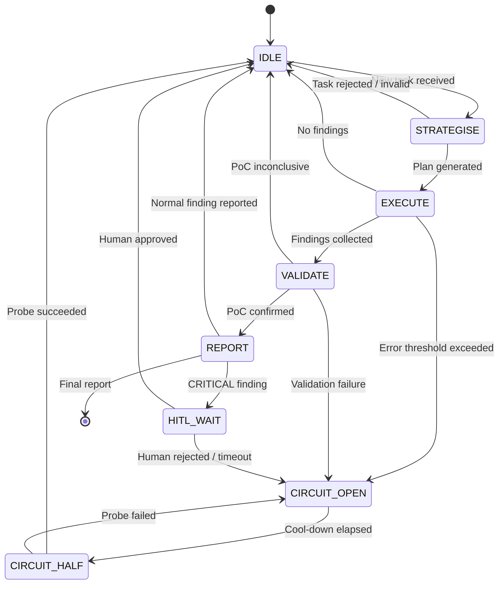

# Agent State Machine

> *State transitions for the Cognitive Swarm agents, including circuit breaker states.*



## Agent State Schema

```python
@dataclass
class AgentState:
    id: str                              # Agent identifier
    cognitive_load: float                 # Current load (0.0 - 1.0)
    active_missions: List[str]           # Active mission IDs
    last_trace_id: Optional[str]          # Most recent CherenkovTrace
    circuit_breaker_status: str           # OPEN, HALF_OPEN, CLOSED
    current_state: str                    # IDLE | STRATEGISE | EXECUTE | VALIDATE | REPORT | HITL_WAIT | CIRCUIT_OPEN | CIRCUIT_HALF
```

## State Transition Rules

| From | To | Trigger | Action |
|---|---|---|---|
| IDLE | STRATEGISE | TENSOR receives task | Generate attack chain |
| STRATEGISE | EXECUTE | Plan validated | Dispatch to KINETIC |
| EXECUTE | VALIDATE | Findings collected | Send to TOKAMAK |
| VALIDATE | REPORT | PoC succeeds | Compile CherenkovTrace |
| REPORT | HITL_WAIT | Severity == CRITICAL | Await human signature |
| any | CIRCUIT_OPEN | Error rate > threshold | Exponential backoff |
| CIRCUIT_OPEN | CIRCUIT_HALF | Cooldown elapsed | Single probe attempt |
| CIRCUIT_HALF | IDLE | Probe passes | Resume normal ops |