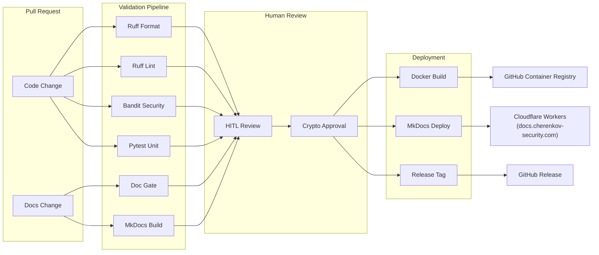

# CI/CD Pipeline

> *The automated quality and deployment pipeline for CHERENKOV.*

## Pipeline Stages

| Stage | Tool / Action | Gate | Failure Behaviour |
|---|---|---|---|
| Format | ruff format --check | ✅ Must pass | PR blocked |
| Lint | ruff check | ✅ Must pass | PR blocked |
| Security | bandit -ll | ✅ Must pass | PR blocked |
| Unit Tests | pytest | ✅ Must pass | PR blocked |
| Doc Gate | dev_crew/doc_gate.py | ✅ Must pass | PR blocked |
| Doc Build | mkdocs build --strict | ✅ Must pass | PR blocked |
| HITL Review | Human approval | ✅ Required for core changes | PR blocked |
| Docker Build | docker buildx | ⚠️ Warning only | Notify maintainer |
| Deploy | wrangler deploy | ✅ After merge | Auto-rollback |

## What Triggers What

| Trigger | Action |
|---|---|
| Push to `docs/368-*` | Validation pipeline only |
| PR opened against `main` | Validation pipeline + HITL (if core) |
| Push to `main` | Full deploy: Docker + MkDocs + Release |
| Comment `/deploy` on PR | Manual deploy trigger (maintainer only) |