# Data Flow

> *How data moves through the Trident: MEISSNER → ABLATION → KINETIC → TOKAMAK.*

```mermaid
flowchart LR
    subgraph Input
        A[Target URL/APK/IP]
    end

    subgraph MEISSNER["MEISSNER (Shield)"]
        B[Ingress Proxy]
        C[Egress Filter]
        B --> C
    end

    subgraph ABLATION["ABLATION (Sovereignty)"]
        D[Payload Inspector]
        E[PII Redactor]
        F[RedactionMap]
        D --> E
        E --> F
    end

    subgraph KINETIC["KINETIC (Executor)"]
        G[Scan Scheduler]
        H[Scanner Workers]
        I[Result Collector]
        G --> H
        H --> I
    end

    subgraph TOKAMAK["TOKAMAK (Proof)"]
        J[PoC Sandbox]
        K[Evidence Logger]
        L[Signer SHA-256]
        J --> K
        K --> L
    end

    subgraph Output
        M[CherenkovTrace]
        N[Shred Receipt]
        O[Dashboard / API]
    end

    A --> B
    C --> D
    F --> G
    I --> J
    L --> M
    M --> O
    L --> N
```

## Data Flow Stages

| Stage | Component | Action | Guarantee |
|---|---|---|---|
| 1. Ingress | MEISSNER | Accept target, validate format, drop unauthorised | Fail-closed |
| 2. Sanitise | ABLATION | Inspect payload, redact PII/credentials, map redactions | No data leakage |
| 3. Execute | KINETIC | Schedule scanners, collect findings, aggregate results | Parallel execution |
| 4. Validate | TOKAMAK | Execute PoC in sandbox, log evidence, sign trace | Cryptographic proof |
| 5. Report | Dashboard | Display CherenkovTrace, emit Shred Receipt, store in WAL | Immutable audit trail |

## Zero-Egress Guarantee

Every outbound data path (dotted lines) is physically blocked by the MEISSNER egress filter. The only permitted outbound flows are:

1. **ABLATION-redacted payloads** to approved local models (Ollama, Qdrant)
2. **Cryptographic Shred Receipts** to the local WAL database
3. **Dashboard metadata** to the React HUD (localhost only)