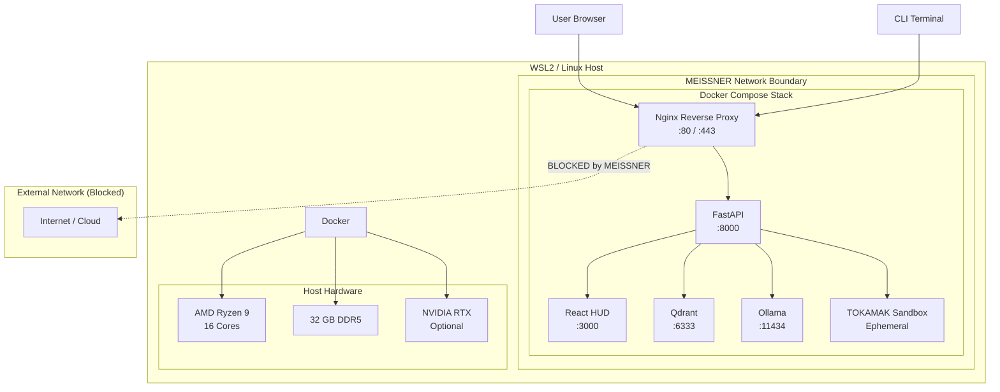

# Deployment Topology

> *The physical and logical network boundaries of the CHERENKOV stack.*

## Port Map

| Service | Internal Port | Protocol | Access |
|---|---|---|---|
| Nginx | 80, 443 | HTTP/HTTPS | Host LAN |
| FastAPI | 8000 | HTTP/WS | Internal only |
| React HUD | 3000 | HTTP | Host LAN (via Nginx) |
| Qdrant | 6333 | gRPC | Internal only |
| Ollama | 11434 | HTTP | Internal only |
| TOKAMAK Sandbox | Dynamic | Ephemeral | Internal only |

## Air-Gap Enforcement

| Vector | Enforcement | Mechanism |
|---|---|---|
| Outbound HTTP(S) | DROPPED | iptables rules + Docker network policy |
| DNS queries | DROPPED | MEISSNER DNS proxy returns NXDOMAIN for external |
| Package installs | RESTRICTED | Private registry mirror + pre-approved cache |
| LLM inference | LOCAL ONLY | Ollama on localhost, never cloud API |
| Vector DB | LOCAL ONLY | Qdrant in Docker, no external sync |