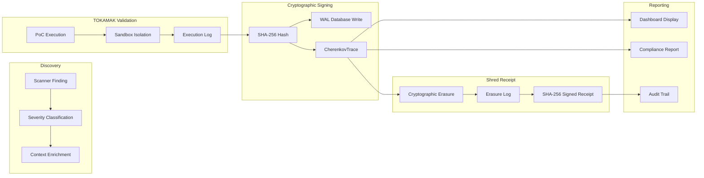

# Evidence Chain

> *How a finding becomes a cryptographically signed CherenkovTrace, then a Shred Receipt.*



## Evidence Schema (CherenkovTrace)

```json
{
  "trace_id": "sha256:a1b2c3d4...",
  "timestamp": "2026-05-25T12:00:00Z",
  "scanner": "xss-verifier",
  "target": "http://dvwa.local/vulnerabilities/xss_r/",
  "finding": {
    "type": "Reflected XSS",
    "severity": "HIGH",
    "cwe": "CWE-79",
    "payload": "<script>alert(1)</script>",
    "evidence": "sha256:proof_of_execution..."
  },
  "poc_result": {
    "executed": true,
    "output": "Alert dialog confirmed",
    "sandbox_id": "tokamak-7f8e9d"
  },
  "signature": "0x...",
  "signed_by": "TOKAMAK-v1.0"
}
```

## Shred Receipt Schema

```json
{
  "receipt_id": "shred-abc123",
  "trace_id": "sha256:a1b2c3d4...",
  "erasure_timestamp": "2026-05-25T12:05:00Z",
  "method": "cryptographic_shred_aes256",
  "artifacts_erased": [
    "poc_binary",
    "sandbox_logs",
    "temp_credentials"
  ],
  "verification_hash": "sha256:erasure_proof...",
  "shred_signature": "0x..."
}
```

## Audit Trail Properties

| Property | Guarantee | Mechanism |
|---|---|---|
| **Immutability** | Once written, never modified | WAL + WORM storage |
| **Non-repudiation** | Signer identity verified | SHA-256 + HSM signature |
| **Chain of custody** | Every action linked to previous trace | Chained hash pointers |
| **Erasure proof** | Data destruction verifiable | Shred Receipt with verification hash |
| **Compliance ready** | ISO 27001, EGY-FIN, SAMA, DORA | Pre-built report templates |