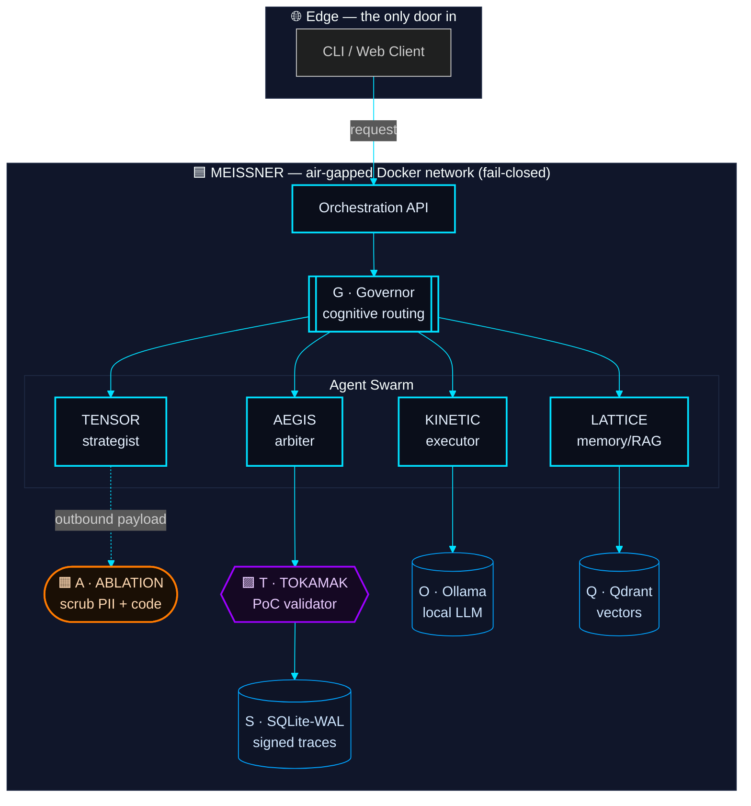
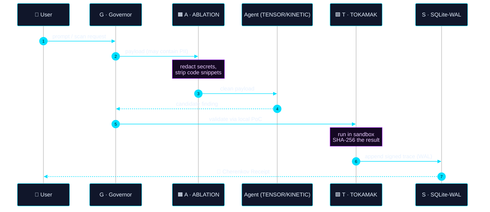
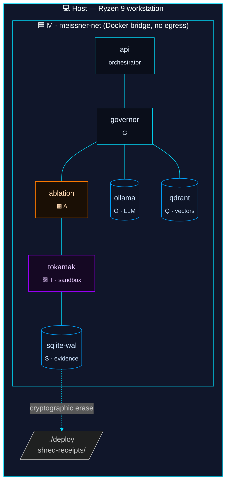

# CHERENKOV — High-Level Design

> A cosy, three-lens view of the system. Each lens zooms differently on the
> **same** components, so a node named `ABLATION` in *System* is the same
> `ABLATION` you see in *Flow* and the same container you see in *Deployment*.
>
> **Brand palette** — used consistently across all diagrams:
> - 🟦 `#00E0FF` — **MEISSNER** (network, sovereignty, boundaries)
> - 🟪 `#9D00FF` — **TOKAMAK** (validation, evidence, trust)
> - 🟧 `#FF7A00` — **ABLATION** (sanitisation, PII scrub)
> - ⬛ `#0A0E1A` — air-gapped substrate
> - ⚪ `#E6F1FF` — text on dark

---

## Legend & Component Map

| ID  | Name        | Role                                  | Appears in lens |
|-----|-------------|---------------------------------------|-----------------|
| `M` | MEISSNER    | Air-gapped Docker network boundary    | 1 · 2 · 3       |
| `A` | ABLATION    | PII / code-snippet scrubber           | 1 · 2 · 3       |
| `T` | TOKAMAK     | PoC validation + WAL-signed trace     | 1 · 2 · 3       |
| `G` | Governor    | Cognitive router across agents        | 1 · 2           |
| `O` | Ollama      | Local LLM inference (Ryzen 9)         | 1 · 3           |
| `Q` | Qdrant      | Vector memory (LATTICE)               | 1 · 3           |
| `S` | SQLite-WAL  | Forensic evidence store               | 1 · 2 · 3       |

Use these IDs to jump between lenses below.

---

## Lens 1 — Whole System (zoom: 🔭)

Every subsystem, one frame. Read it like a city map.



---

## Lens 2 — Core Flow (zoom: 🔬)

One request, end-to-end. Same nodes as Lens 1, arranged as a story.



---

## Lens 3 — Deployment Topology (zoom: 🛰️)

Where each box from Lens 1 actually runs. The dashed boundary is **MEISSNER**:
no arrow crosses it outbound.



---

## How the lenses connect

```
Lens 1 (System)        Lens 2 (Flow)         Lens 3 (Deployment)
─────────────────      ──────────────        ─────────────────────
G   Governor      ◄──► step ②,⑤             container: governor
A   ABLATION      ◄──► step ③               container: ablation
T   TOKAMAK       ◄──► step ⑥               container: tokamak
S   SQLite-WAL    ◄──► step ⑦               container: sqlite-wal
M   MEISSNER      ◄──► (implicit boundary)  network: meissner-net
```

Pick the lens that matches the question you're asking:

- **"What does the system *contain*?"** → Lens 1
- **"What *happens* on a request?"** → Lens 2
- **"Where does it *run*?"** → Lens 3

All three describe the same machine.
