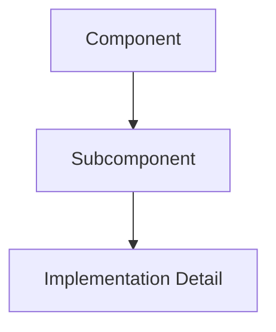

# Architecture

CHERENKOV is built on the **Trident of Truth** — three unyielding components that enforce zero-egress security testing, backed by a **Cognitive Swarm** of specialized AI agents.

## The Trident

| Component | Role | Constraint |
|---|---|---|
| [MEISSNER](meissner.md) | Network shield | Zero-egress, drops unauthorized outbound packets |
| [ABLATION](ablation.md) | Data redaction | Strips PII before any data can leave |
| [TOKAMAK](tokamak.md) | Proof validation | Sandboxed PoC execution with cryptographic signing |

## Cognitive Swarm

| Agent | Engine | Role |
|---|---|---|
| [TENSOR](swarm.md) | Groq Llama 3.1 8B | Strategic planning |
| [KINETIC](swarm.md) | Ollama Llama 3.2 3B | Local execution |
| [AEGIS](swarm.md) | Local Llama 3.1 8B | Circuit breaker / arbiter |
| [LATTICE](swarm.md) | Qdrant + Embeddings | Memory & RAG |

## Deep Dives

| Page | Description |
|---|---|
| [System Architecture (Detailed)](system-architecture.md) | Multi-agent routing and Arabic AI |
| [High-Level Design](hld-diagram.md) | System topology diagram |
| [Low-Level Design](lld-diagram.md) | Sequence diagram |
| [System Design & State Machine](system-design.md) | Agent state, orchestration flow, BurhanTrace |
| [Design Patterns](design-patterns.md) | AgentGovernor, AIMD, Proxy, Command patterns |

