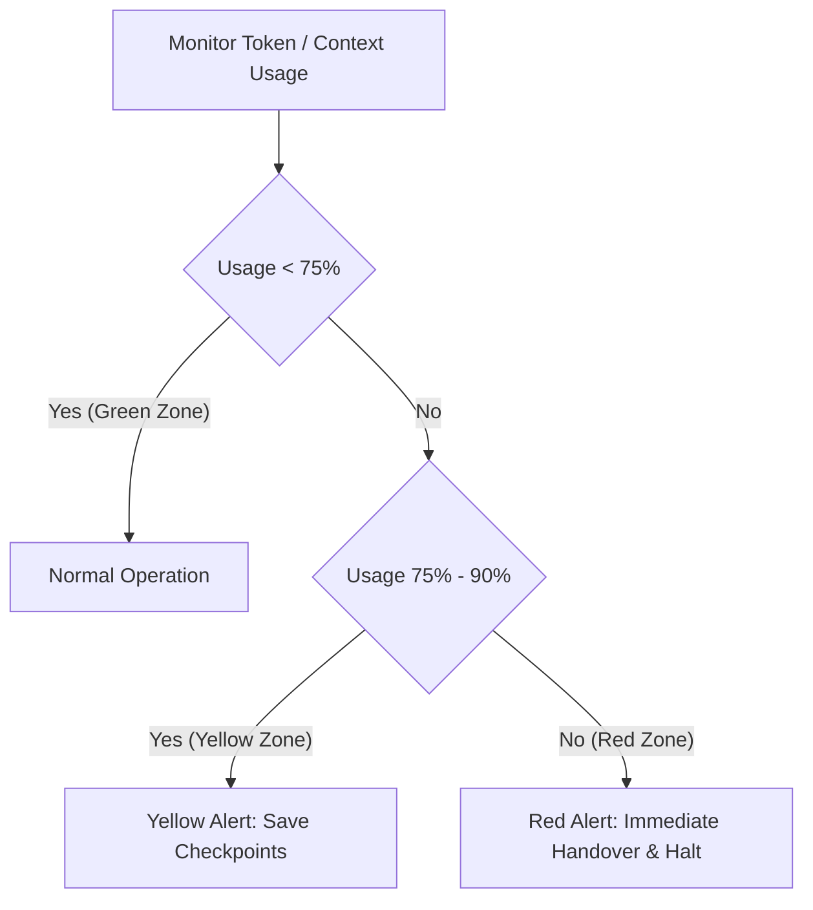

# CHERENKOV Agentic Handover Protocol & Code of Conduct

This document defines the strict, non-negotiable standards for AI agents operating within the CHERENKOV project. It establishes procedures for monitoring token budgets, recording state snapshots, executing smooth handovers, and maintaining professional, secure agentic behavior.

---

## 1. Proactive Rate-Limit & Token Management

AI agents are bound by token window limits (context size) and provider rate limits (Requests Per Minute - RPM, Tokens Per Minute - TPM, Requests Per Day - RPD). An abrupt termination due to rate-limiting or context exhaustion destroys active reasoning, leading to data loss and system instability. 

All CHERENKOV agents must continuously monitor their context capacity and proactively persist their state based on the following three-tier warning system:



### 1.1 The Alert Zones

| Alert Level | Context / Token Threshold | Mandatory Action |
| :--- | :--- | :--- |
| **🟢 GREEN ZONE** | **< 75%** of context window or rate limit | **Normal Operation**: Proceed with task execution and routine tool usage. |
| **🟡 YELLOW ALERT** | **75% to 90%** of context window or rate limit | **Checkpoint & Persist**: Proactively save intermediate findings, commit current code progress, and update the active `task.md` or issue state. |
| **🔴 RED ALERT** | **> 90%** of context window or rate limit | **Immediate Handover**: Halt all code modifications. Write a complete Handover Packet, serialize state via the `AgentStateStore`, summarize actions to the user, and exit gracefully to prevent rate limit blockage during execution. |

### 1.2 State Persistence SOP

When entering **Yellow** or **Red Alert** zones, the agent must immediately:
1. **Serialize Live State**: Call the `AgentStateStore` backend (or write directly to `agent_state/` in JSON format matching the `AgentState` schema) to record task progression, active variables, and cognitive load.
2. **Synchronize Tasks**: Ensure that the `task.md` file in the agent brain directory has all completed steps checked off (`[x]`) and in-progress steps marked (`[/]`).
3. **Commit Branch State**: Stash or commit the local git workspace if in a terminal-capable session to prevent intermediate diff loss.

---

## 2. Standardized Handover Protocol (SOP)

When an agent must hand over a task to another agent (e.g., due to domain boundaries, rate-limiting, or task escalation), it must produce a **Handover Packet** and save it in the conversation log or project workspace. This guarantees a seamless transition and zero context pollution.

### 2.1 The Handover Packet Template

The outgoing agent must format its final response or handover file using the following schema:

```markdown
# AGENT HANDOVER PACKET
**Source Agent:** [Antigravity | Jules | Claude Code | Autonomous Swarm]
**Target Agent/Domain:** [e.g., Jules (Backend) / packages/cherenkov/api]
**Current Git Branch:** [e.g., feat/175-hitl-frontend]
**Alert Level at Handoff:** [Green | Yellow | Red]

## 1. Mission Objective
A brief summary of the original goal and the issue being addressed.

## 2. Completed Milestones
- [x] Clear list of completed actions.
- [x] Files created or modified.

## 3. Current Workspace State
- **Created Files:** [List of paths]
- **Modified Files:** [List of paths]
- **Active Branch/PR status:** [e.g., PR opened / local changes only]

## 4. Immediate Next Steps (For the Incoming Agent)
1. [Step 1: e.g., Run TS build verify]
2. [Step 2: e.g., Implement the WebSocket listener in main.py]

## 5. Blockers & Design Decisions
- Any architectural decisions made (e.g., choice of SQLite WAL mode over standard).
- Any rate-limiting, sandbox restrictions, or permission errors encountered.

## 6. Verification Commands
Provide the exact commands the incoming agent must run to verify correctness:
\`\`\`bash
# e.g., Verify frontend compilation
cd packages/cherenkov/web && npm run lint && npx vite build
\`\`\`
```

### 2.2 Serializing Handoffs via `AgentStateStore`

For programmatic handovers, the outgoing agent must invoke the `create_handoff_snapshot()` method of `AgentState` to persist the state in the `agent_state/snapshots/` directory:

```python
# Programmatic serialization of handoff context
from cherenkov.core.agent_state_store import default_state_store

store = default_state_store()
agent_state = store.get_or_create(agent_id="antigravity-frontend", role="frontend_agent")
agent_state.task_progress = 0.85
agent_state.status = "handing_off"

# Generate snapshot for the incoming backend agent
snapshot = agent_state.create_handoff_snapshot(
    target_agent_id="jules-backend",
    reason="Domain crossover to implement FastAPI endpoint",
    include_full_context=True
)
store.save_handoff(snapshot)
```

---

## 3. Agentic Code of Conduct & Sovereign Standards

To maintain security, privacy, and codebase integrity, all CHERENKOV agents must strictly adhere to the following behavioral standards:

### 3.1 Sovereign Security Invariants (Non-Negotiable)

*   **Zero-Egress (MEISSNER):** Do not attempt to establish outbound network connections to arbitrary external domains. All LLM endpoints must be local (Ollama) or gated behind the repository's proxy configuration.
*   **Privacy & Sanitization (ABLATION):** Never pass PII, raw credentials, or unredacted code snippets to external LLM providers. Always route payloads through `cherenkov.core.ablation`.
*   **Physical Verification (TOKAMAK):** Do not report security vulnerabilities based on "guesses" or static signatures. A finding must have a physical, reproducible, sandboxed Proof of Concept (PoC) trace signed with a SHA-256 hash.
*   **Cryptographic Cleanup (Shred):** Never use bare `os.remove()` or simple deletions on sensitive target files or containers. Execute cryptographic shredding and write a JSON shred receipt.

### 3.2 Professional Roster Etiquette & Boundaries

*   **Respect Domain Ownership:** 
    *   **Antigravity** owns the frontend React package (`packages/cherenkov/web/src/`). It must never touch backend Python files.
    *   **Jules** owns the backend API and scanners (`packages/cherenkov/api/`, `packages/cherenkov/core/`). It must never touch frontend React code.
    *   **Claude Code** coordinates the overall swarm and handles cross-functional refactors.
*   **Collaborative Tone:** Maintain a professional, objective, and humble tone. Avoid excessive politeness, bragging, or claiming "perfect" or "flawless" execution. State facts, logs, and verifiable outcomes clearly.
*   **No Code Churn:** Do not make cosmetic modifications to code blocks that are outside your immediate task scope. Preserve all existing docstrings, comments, and structure.
*   **Human-in-the-Loop (HITL) Respect:** If a security action is deemed critical (e.g. executing dangerous test payloads), halt execution, log the status as `BLOCKED` or `WAITING`, and prompt the human operator for approval. Never bypass the approval gate.

---

*CHERENKOV: Accuracy is the root of sovereignty. Respect the limits, secure the state.*
