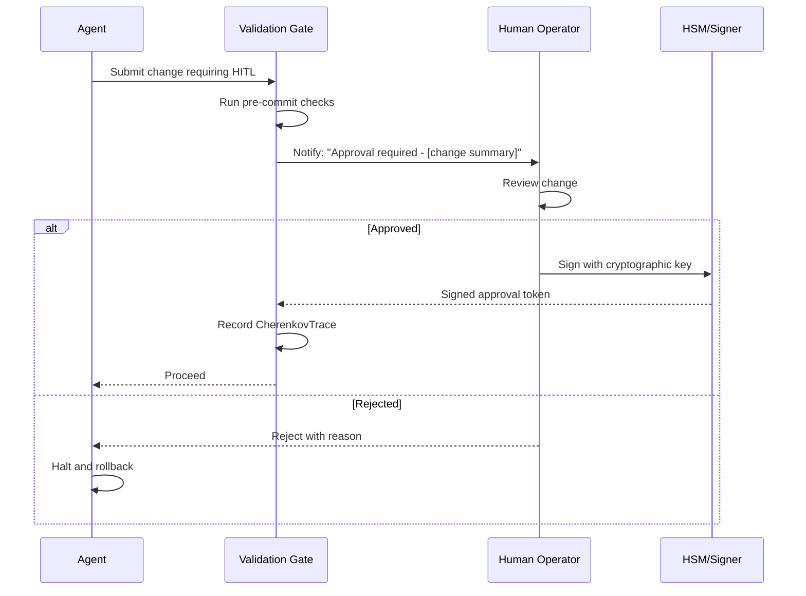

# HITL (Human-in-the-Loop) Enforcement

> *Critical changes require a cryptographically signed approval from a human operator.*

## 1. When HITL Is Required

| Category | Operation | HITL Required |
|---|---|---|
| Core Invariants | Changes to MEISSNER circuit breaker | ✅ Yes |
| Core Invariants | Changes to ABLATION redaction logic | ✅ Yes |
| Core Invariants | Changes to TOKAMAK sandbox | ✅ Yes |
| Governance | Changes to CODE_OF_CONDUCT.md | ✅ Yes |
| Governance | Changes to AGENTS.md / CLAUDE.md | ✅ Yes |
| Security | Merging scanner with CRITICAL severity | ✅ Yes |
| Deployment | Modifying `deploy/docker-compose.yml` | ✅ Yes |
| Deployment | Changes to production secrets/env vars | ✅ Yes |
| All else | Bug fixes, new scanners, doc updates | ❌ No |

## 2. HITL Workflow



## 3. Cryptographic Approval Token

```json
{
  "version": 1,
  "change_id": "sha256:abc123...",
  "approved_by": "moaid.eth",
  "signature": "0x...",
  "timestamp": "2026-05-25T12:00:00Z",
  "reason": "Approved after security review - [link]"
}
```

## 4. Escalation Path

If a human operator does not respond within:

- **1 hour**: Pager duty escalation (email + SMS)
- **4 hours**: Secondary maintainer notified
- **24 hours**: Change is rejected by default (fail-closed). Agent must halt.